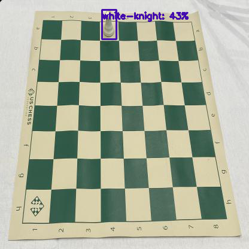
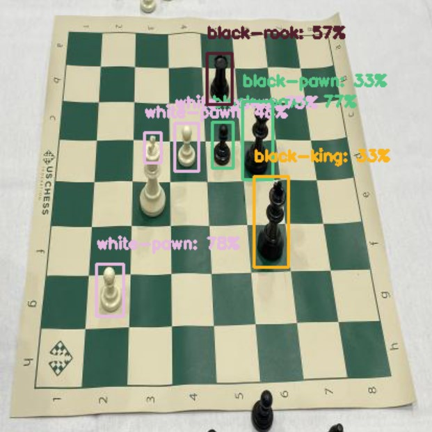

## Object Detection in TFLite
_***TensorFlow Lite is a set of tools that enables on-device machine learning by helping developers run their models on mobile, embedded, and IoT devices.***_

## About the Model
### Detecting Chess Pieces on Chess Board
The model detects the following chess pieces on board and draws identification boxes around them.

Click to expand

* _Black-Bishop_
* _Black-King_
* _Black-Knight_
* _Black-Pawn_
* _Black-Queen_
* _Black-Rook_
* _White-Bishop_
* _White-King_
* _White-Knight_
* _White-Pawn_
* _White-Queen_
* _White-Rook_

The dataset for training was collected from [Roboflow](https://public.roboflow.com/object-detection/chess-full/24). The dataset has been split into three sections 1) Train 2) Test 3) Validation. The dataset already contained annotations in XML format. Tensorflow Lite framework was used for Data Augmentation and Model building. The model was trained for 20 epoch cycles, with a training time of around 40 minutes.

**EfficientDet-Lite4** architecture has been used to train the model, it has the highest accuracy among all variants of EfficeintDet with a small tradeoff for latency & model size.

                                                      Model in Action
<!--  -->

[Download TensorFlow Lite Model here](https://drive.google.com/file/d/1QcmJwUgNz1ZaWoF9EjES3OzDRK-0ks_F/view?usp=sharing)
 
[Google Collab](https://colab.research.google.com/drive/1s63yBOXuNJ4GjNYIqAgLYF2xnKDAYw_i?usp=sharing)

## Further Plans
- [x] Integrate the model with IOS/Android mobile app
- [X] Further improve the accuracy of model using other CNN architectures
